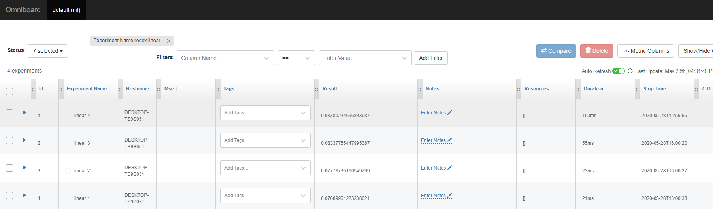
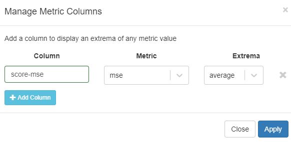
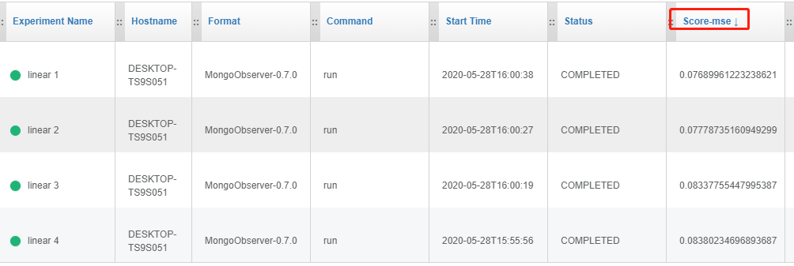
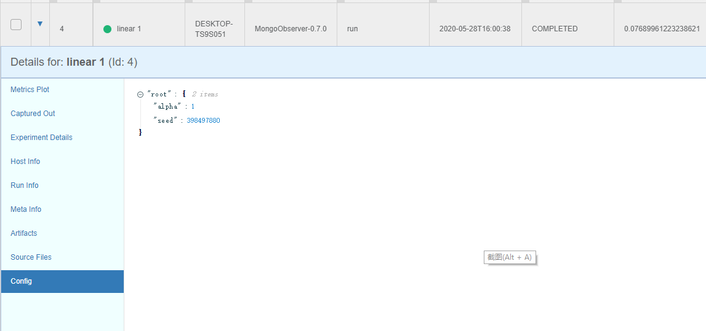

# 机器学习模型训练记录与可视化前端

每次实验都是神圣的，

不要浪费你的实验，

管理好每次实验，让他们可复现，并保持快速迭代。


采用[Sacred](https://github.com/IDSIA/sacred)记录框架， [Omniboard](https://github.com/vivekratnavel/omniboard) Web可视化前端，Mongodb作为实验记录存储环境，现在是效果图：



## 环境配置

### Windows

1. 安装sacred

   `pip install sacred`

2. 安装Omniboard，需要确保你已经安装Node.js v8或更高版本

   ` npm install -g omniboard `

3. 官网下载并安装Mongodb

4. 创建Mongodb实例并启动服务

   - 在安装目录`~/MongoDB/Server/4.2/data` 下创建

   - 启动Mongodb服务

     ```powershell
     # 管理员身份打开命令行工具
     # 路径进入 ~/MongoDB/Server/4.2/bin下
     $> mongod --dbpath "C:\Program Files\MongoDB\Server\4.2\data\ml" --port "8888"
     ```

     此时可以在窗口看到类似信息：

     ```
     C:\Program Files\MongoDB\Server\4.2\bin>mongod --dbpath "C:\Program Files\MongoDB\Server\4.2\data\ml" --port "8888"
     2020-05-28T15:40:12.016+0800 I  CONTROL  [main] Automatically disabling TLS 1.0, to force-enable TLS 1.0 specify --sslDisabledProtocols 'none'
     2020-05-28T15:40:12.019+0800 W  ASIO     [main] No TransportLayer configured during NetworkInterface startup
     2020-05-28T15:40:12.022+0800 I  CONTROL  [initandlisten] MongoDB starting : pid=14108 port=8888 dbpath=C:\Program Files\MongoDB\Server\4.2\data\ml 64-bit host=DESKTOP-TS9S051
     2020-05-28T15:40:12.022+0800 I  CONTROL  [initandlisten] targetMinOS: Windows 7/Windows Server 2008 R2
     2020-05-28T15:40:12.022+0800 I  CONTROL  [initandlisten] db version v4.2.7
     2020-05-28T15:40:12.022+0800 I  CONTROL  [initandlisten] git version: 51d9fe12b5d19720e72dcd7db0f2f17dd9a19212
     2020-05-28T15:40:12.023+0800 I  CONTROL  [initandlisten] allocator: tcmalloc
     2020-05-28T15:40:12.023+0800 I  CONTROL  [initandlisten] modules: none
     2020-05-28T15:40:12.023+0800 I  CONTROL  [initandlisten] build environment:
     2020-05-28T15:40:12.023+0800 I  CONTROL  [initandlisten]     distmod: 2012plus
     2020-05-28T15:40:12.024+0800 I  CONTROL  [initandlisten]     distarch: x86_64
     2020-05-28T15:40:12.024+0800 I  CONTROL  [initandlisten]     target_arch: x86_64
     2020-05-28T15:40:12.024+0800 I  CONTROL  [initandlisten] options: { net: { port: 8888 }, storage: { dbPath: "C:\Program Files\MongoDB\Server\4.2\data\ml" } }
     ...
     ```

### Ubuntu

TODO

Reliable, efficient and sustainable management & tools of machine learning projects.

## 实验记录

这里我以一个简单项目作为案例，具体详细使用方法请参考Sacred官方文档。

```python
# encoding: utf-8
from sacred import Experiment
from sacred.observers import MongoObserver
import numpy as np
from sklearn.linear_model import Ridge
from sklearn.metrics import mean_squared_error

ex = Experiment("linear 1")
obv = MongoObserver(url="localhost", port=8888, db_name="ml")
ex.observers.append(obv)

@ex.config
def config():
    alpha = 1.0


@ex.automain
def run():
    x = np.random.rand(200, 8)
    y = np.random.rand(200)
    model = Ridge(alpha=1.0)
    model.fit(x, y)
    mse = mean_squared_error(model.predict(x), y)
    ex.log_scalar("mse", mse)
    return float(mse)

```

进入终端运行，并尝试调节`alpha`参数，多次进行实验：

```$> python example.py```

## 前端界面查看历史实验

1. 启动Omniboard前端

   `omniboard -m localhost:8888:ml`

   终端显示：

   ```
   (node:7408) DeprecationWarning: current Server Discovery and Monitoring engine is deprecated, and will be removed in a future version. To use the new Server Discover and Monitoring engine, pass option { useUnifiedTopology: true } to the MongoClient constructor.
   Omniboard is listening on port 9000!
   Connection to ml at mongodb://localhost:8888 established successfully!
   ```

2. 打开浏览器，键入 http://localhost:9000/ 可以看到：

   

3. 点击页面右上角 `+/- metric columns`设置模型评价指标

   

4. 将刚才添加的指标排序查看

   

5. 点击最好模型，查看其配置参数等信息

   

## 实践

1. 多项工程，可以通过实验命名进行区分，通过前端自带的过滤工具进行筛选；
2. 一个数据团队，可以在服务器搭建mongodb，小组同一将实验结果进行记录；
3. 统一项目的评价指标，数据集，并进行实验记录，可以帮助团队快速迭代模型；


## 参考文档

1. [Omniboard官方文档](https://vivekratnavel.github.io/omniboard)
2. [Sacred官方]( https://sacred.readthedocs.io/en/stable/quickstart.html )

